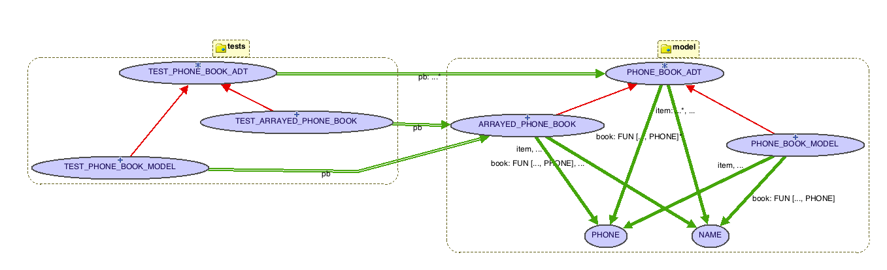

# Testing Strategy

General method for testing multiple implementations of an API with the same tests. We illustrate this with a phone book which is a FUN[NAME,PHONE]. FUN comes from Mathmodels.

Also illustrates the template and simple factory design patterns.

